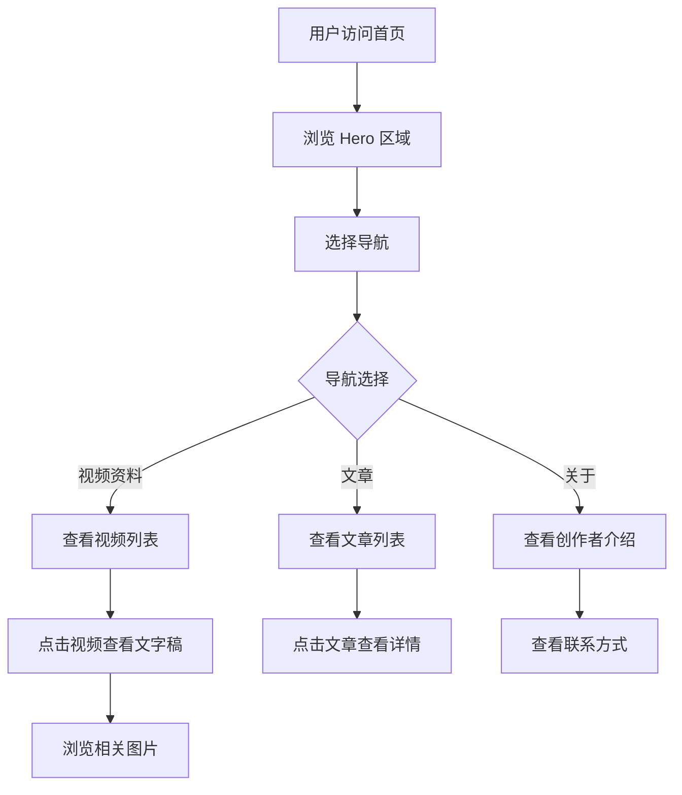

## 1. Product Overview
一个现代化的静态个人网站，用于展示 B 站视频创作者的相关资料，包括视频文字稿、相关图片和文章等内容，便于其他用户浏览和学习。

## 2. Core Features

### 2.1 User Roles
| Role | Registration Method | Core Permissions |
|------|---------------------|------------------|
| 访客 | 无需注册 | 浏览网站所有内容 |
| 管理员 | 本地更新文件 | 更新网站内容 |

### 2.2 Feature Module
1. **首页**: Hero 区域展示创作者信息、导航栏、最新内容预览
2. **视频资料页**: 视频列表、文字稿展示、相关图片
3. **文章页**: 文章列表和详情展示
4. **关于页**: 创作者介绍、联系方式

### 2.3 Page Details
| Page Name | Module Name | Feature description |
|-----------|-------------|---------------------|
| 首页 | Hero section | 展示创作者头像、简介、B站链接，渐变背景动画 |
| 首页 | Navigation | 固定顶部导航，响应式菜单 |
| 首页 | Latest content | 展示最新视频和文章预览卡片 |
| 视频资料页 | Video list | 视频卡片列表，按时间排序 |
| 视频资料页 | Transcript | 视频文字稿展示，支持滚动阅读 |
| 视频资料页 | Gallery | 相关图片展示，网格布局 |
| 文章页 | Article list | 文章卡片列表，支持分类筛选 |
| 文章页 | Article detail | 文章全文展示，阅读进度条 |
| 关于页 | About | 创作者详细介绍、成就、联系方式 |

## 3. Core Process
用户访问网站 → 浏览首页内容 → 点击导航进入对应页面 → 查看视频资料/文章 → 点击B站链接查看原视频



## 4. User Interface Design

### 4.1 Design Style
- **主色调**: B 站主题色（#FB7299 粉色、#00A1D6 蓝色）
- **辅助色**: 灰色系用于背景和文本
- **按钮风格**: 圆角、渐变色、悬停动画效果
- **字体**: 中文使用思源黑体，英文使用 Inter
- **布局风格**: 卡片式布局，现代化简约设计
- **图标**: 使用 Lucide 图标库

### 4.2 Page Design Overview
| Page Name | Module Name | UI Elements |
|-----------|-------------|-------------|
| 首页 | Hero | 渐变背景（粉色到蓝色）、创作者头像、简介文字、CTA按钮 |
| 首页 | Navigation | 固定顶部、白色背景、品牌 Logo、导航链接 |
| 首页 | Latest content | 横向滚动卡片、视频缩略图、标题、发布时间 |
| 视频资料页 | Video list | 网格布局卡片、视频封面、标题、简介、播放量 |
| 视频资料页 | Transcript | 白色背景、深色文字、行高舒适、代码块样式 |
| 视频资料页 | Gallery | 瀑布流网格、图片悬停放大效果、图片说明 |
| 文章页 | Article list | 列表布局、文章封面、标题、摘要、标签 |
| 文章页 | Article detail | 全屏宽度、大标题、内容区域、阅读进度条 |
| 关于页 | About | 创作者照片、详细介绍、B站二维码、社交媒体链接 |

### 4.3 Responsiveness
- **桌面端**: 完整布局，多列展示
- **平板端**: 两列布局，导航简化
- **移动端**: 单列布局，汉堡菜单

### 4.4 Animation
- 页面加载时元素渐入动画
- 悬停时卡片上浮、阴影加深
- 滚动时导航栏背景变化
- 图片懒加载淡入效果

## 5. Project Structure
```
src/
├── components/          # 公共组件
│   ├── Header.tsx       # 导航头部（响应式，滚动变化）
│   ├── Footer.tsx       # 页脚（社交链接、订阅表单）
│   ├── VideoCard.tsx    # 视频卡片（悬停播放按钮效果）
│   ├── ArticleCard.tsx  # 文章卡片（分类标签）
│   └── Gallery.tsx      # 图片画廊（点击放大预览）
├── pages/               # 页面组件
│   ├── Home.tsx         # 首页（Hero、统计数据、最新内容）
│   ├── Videos.tsx       # 视频列表页（搜索、标签筛选）
│   ├── VideoDetail.tsx  # 视频详情页（文字稿、图片画廊）
│   ├── Articles.tsx     # 文章列表页（分类筛选、统计数据）
│   ├── ArticleDetail.tsx# 文章详情页（Markdown渲染、相关文章）
│   └── About.tsx        # 关于页（个人介绍、技能、联系表单）
├── data/                # 静态数据
│   ├── videos.ts        # 视频数据（含文字稿、图片）
│   └── articles.ts      # 文章数据（含分类、标签）
├── types/               # TypeScript 类型定义
│   └── index.ts         # 全局类型（Video、Article、GalleryImage）
├── App.tsx              # 应用根组件（路由配置）
├── main.tsx             # 入口文件
└── index.css            # 全局样式（自定义滚动条、动画）
```

## 6. Deployment
- **部署方式**: GitHub Pages
- **构建命令**: `npm run build`
- **部署命令**: `npm run deploy`
- **CI/CD**: GitHub Actions 自动部署
- **访问地址**: `https://<username>.github.io/<repo-name>/`
