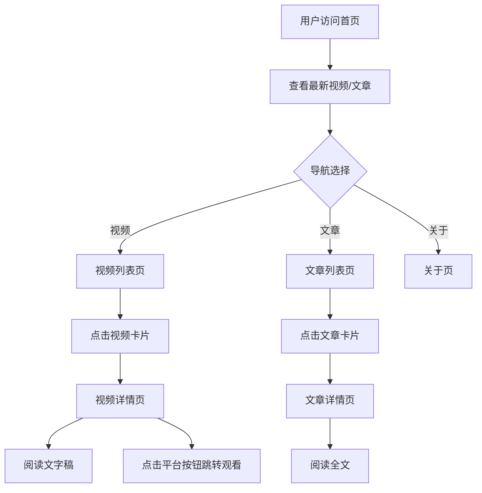

# 星渊博客 - 产品需求文档

## 1. 产品概述

**星渊博客**是一个现代化的静态个人网站，用于展示 B 站游戏区 UP 主"星渊"的视频文字稿和文章内容，便于观众浏览和学习。

### 1.1 项目定位
- **类型**: 静态个人博客网站
- **目标用户**: B站观众、游戏爱好者
- **部署平台**: GitHub Pages
- **访问地址**: https://asterial0306.github.io/Asterial-Blog/

### 1.2 站点信息
- **网站名称**: 星渊博客
- **网站描述**: 星渊的个人网站
- **UP主**: 星渊（游戏区UP）
- **B站空间**: https://space.bilibili.com/645774959

---

## 2. 核心功能

### 2.1 用户角色

| 角色 | 注册方式 | 核心权限 |
|------|----------|----------|
| 访客 | 无需注册 | 浏览网站所有公开内容 |
| 管理员 | 本地更新代码文件 | 更新网站内容、维护代码 |

### 2.2 功能模块

| 模块 | 功能说明 | 状态 |
|------|----------|------|
| 首页 | 展示最新视频和文章预览 | ✅ 已实现 |
| 视频列表页 | 视频卡片列表展示 | ✅ 已实现 |
| 视频详情页 | 视频封面、文字稿、多平台观看链接 | ✅ 已实现 |
| 文章列表页 | 文章卡片列表展示 | ✅ 已实现 |
| 文章详情页 | 文章全文展示、相关推荐 | ✅ 已实现 |
| 关于页 | 个人介绍、头像、B站链接 | ✅ 已实现 |
| 导航系统 | 固定顶部导航、响应式菜单 | ✅ 已实现 |
| 页脚 | 网站信息、导航链接、社交图标 | ✅ 已实现 |

### 2.3 页面详情

#### 首页 (Home)
- 最新视频区域（展示前3个视频卡片）
- 最新文章区域（展示前3个文章卡片）
- 空状态展示（无内容时显示占位提示）
- 查看全部按钮跳转对应列表页

#### 视频列表页 (Videos)
- 粉色顶部区域（面包屑导航、页面标题、描述）
- 视频数量统计
- 视频卡片网格布局（响应式：1/2/3列）
- 空状态展示
- 返回顶部按钮（滚动超过300px显示）

#### 视频详情页 (VideoDetail)
- 粉色顶部区域（返回按钮、视频标题）
- 视频封面图
- 发布日期、分类标签、内容标注（个人观点，仅供参考）
- 视频简介卡片
- 多平台观看链接按钮（B站、抖音等）
- 视频文字稿（支持 Markdown 格式渲染）

#### 文章列表页 (Articles)
- 粉色顶部区域（面包屑导航、页面标题、描述）
- 文章数量统计
- 文章卡片网格布局（响应式：1/2/3列）
- 空状态展示
- 返回顶部按钮（滚动超过300px显示）

#### 文章详情页 (ArticleDetail)
- 粉色顶部区域（返回按钮、文章标题）
- 文章封面图
- 发布日期、分类、阅读时间
- 分享和收藏按钮
- 标签列表
- 文章正文（支持 Markdown 格式渲染）
- 相关文章推荐

#### 关于页 (About)
- 灰色顶部区域（页面标题、描述）
- 个人头像
- 个人介绍文案
- B站链接按钮

---

## 3. 核心流程

```
用户访问网站 → 浏览首页内容 → 选择导航入口 → 查看详细内容 → 跳转B站观看原视频
```



---

## 4. 界面设计

### 4.1 设计风格
- **主色调**: B站粉色 #FB7299
- **辅助色**: B站蓝色 #00A1D6、紫色 #8E82FE、橙色 #FF9F43
- **背景色**: 白色 #FFFFFF、浅灰 #F8FAFC、深灰 #111827
- **文字色**: 深灰 #1F2937、中灰 #6B7280、浅灰 #9CA3AF
- **按钮风格**: 方形圆角、单色背景、悬停透明度变化
- **字体**: PingFang SC / Hiragino Sans GB / Microsoft YaHei
- **布局风格**: 卡片式布局、现代化简约设计
- **图标**: Lucide React 图标库

### 4.2 响应式设计

| 断点 | 布局 | 导航 |
|------|------|------|
| 桌面端 (>1024px) | 3列网格 | 完整导航栏 |
| 平板端 (768-1024px) | 2列网格 | 完整导航栏 |
| 移动端 (<768px) | 1列网格 | 汉堡菜单 |

### 4.3 动画效果
- 卡片悬停：上浮 + 阴影加深 + 封面图放大
- 按钮悬停：透明度变化 + 缩放
- 返回顶部按钮：滚动超过300px淡入
- 图片加载：懒加载 + 占位骨架屏
- 导航栏：固定顶部、毛玻璃效果

### 4.4 页面设计规范

#### 颜色使用规范
- 强调色：`bilibili-pink` (#FB7299) 用于按钮、链接高亮、标签
- 主背景：白色 `bg-white`
- 次要背景：浅灰 `bg-gray-50`
- 页脚背景：深灰 `bg-gray-900`

#### 间距规范
- 页面顶部导航高度：64px (`h-16`)
- 内容区域最大宽度：1280px (`max-w-7xl`)
- 内容区域水平内边距：16px/24px/32px (响应式)
- 卡片圆角：16px (`rounded-2xl`)
- 按钮圆角：8px (`rounded-lg`)

---

## 5. 项目结构

```
Asterial Blog/
├── public/                    # 静态资源（直接复制到构建产物）
│   ├── avatar.png             # 头像
│   ├── cover.jpg              # 视频封面示例
│   └── favicon.svg            # 网站图标
├── src/
│   ├── components/            # 公共组件
│   │   ├── Header.tsx         # 导航头部（固定顶部、响应式菜单）
│   │   ├── Footer.tsx         # 页脚（导航链接、B站图标）
│   │   ├── VideoCard.tsx      # 视频卡片（封面、标题、日期、标签）
│   │   └── ArticleCard.tsx    # 文章卡片
│   ├── pages/                 # 页面组件
│   │   ├── Home.tsx           # 首页（最新视频、最新文章）
│   │   ├── Videos.tsx         # 视频列表页
│   │   ├── VideoDetail.tsx    # 视频详情页（文字稿、平台链接）
│   │   ├── Articles.tsx       # 文章列表页
│   │   ├── ArticleDetail.tsx  # 文章详情页
│   │   └── About.tsx          # 关于页
│   ├── data/                  # 静态数据
│   │   ├── videos.ts          # 视频数据（含文字稿、链接）
│   │   └── articles.ts        # 文章数据
│   ├── config/                # 配置文件
│   │   └── paths.ts           # 资源路径工具函数（适配GitHub Pages）
│   ├── types/                 # TypeScript 类型定义
│   │   └── index.ts           # 全局类型（Video、Article、NavItem、VideoLink）
│   ├── App.tsx                # 应用根组件（路由配置、basename适配）
│   ├── main.tsx               # 入口文件
│   └── index.css              # 全局样式（自定义颜色类、滚动条）
├── .github/
│   └── workflows/
│       └── deploy.yml         # GitHub Actions 自动部署配置
├── .trae/
│   └── documents/
│       ├── PRD.md             # 产品需求文档
│       └── Technical-Architecture.md  # 技术架构文档
├── index.html                 # HTML 入口模板
├── package.json               # 项目依赖和脚本
├── vite.config.ts             # Vite 构建配置
├── tailwind.config.js         # Tailwind CSS 配置
├── tsconfig.json              # TypeScript 配置
└── README.md                  # 项目说明
```

---

## 6. 数据规范

### 6.1 视频数据

| 字段 | 类型 | 必填 | 说明 |
|------|------|------|------|
| id | string | 是 | 唯一标识 |
| title | string | 是 | 视频标题 |
| description | string | 是 | 视频简介 |
| cover | string | 是 | 封面图片路径 |
| category | string | 是 | 分类（如：游戏测评） |
| transcript | string | 是 | 视频文字稿（Markdown格式） |
| date | string | 是 | 发布日期（YYYY-MM-DD） |
| tags | string[] | 是 | 标签数组 |
| links | VideoLink[] | 是 | 多平台观看链接 |

### 6.2 文章数据

| 字段 | 类型 | 必填 | 说明 |
|------|------|------|------|
| id | string | 是 | 唯一标识 |
| title | string | 是 | 文章标题 |
| summary | string | 是 | 文章摘要 |
| cover | string | 是 | 封面图片路径 |
| content | string | 是 | 文章内容（Markdown格式） |
| date | string | 是 | 发布日期（YYYY-MM-DD） |
| tags | string[] | 是 | 标签数组 |
| category | string | 是 | 分类 |

### 6.3 内容标注
- 所有视频详情页显示：`个人观点，仅供参考`
- 位置：发布日期和分类标签旁

---

## 7. 部署说明

### 7.1 部署方式
- **平台**: GitHub Pages
- **触发方式**: 推送到 main 分支自动部署
- **CI/CD**: GitHub Actions
- **构建命令**: `npm run build`
- **访问地址**: https://asterial0306.github.io/Asterial-Blog/

### 7.2 本地开发
```bash
# 安装依赖
npm install

# 启动开发服务器
npm run dev

# 构建项目
npm run build

# 预览构建结果
npm run preview

# 类型检查
npm run check
```

### 7.3 GitHub Pages 适配
- Vite base 路径：`/Asterial-Blog/`
- React Router basename：生产环境 `/Asterial-Blog`
- 静态资源路径：通过 `getAssetUrl()` 函数统一处理
