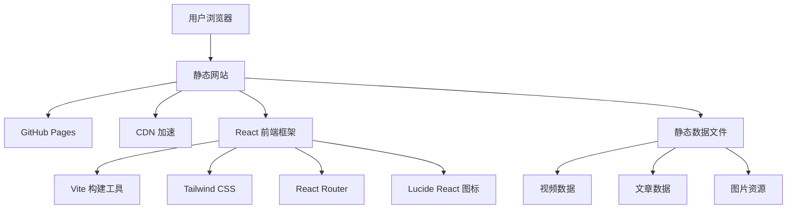
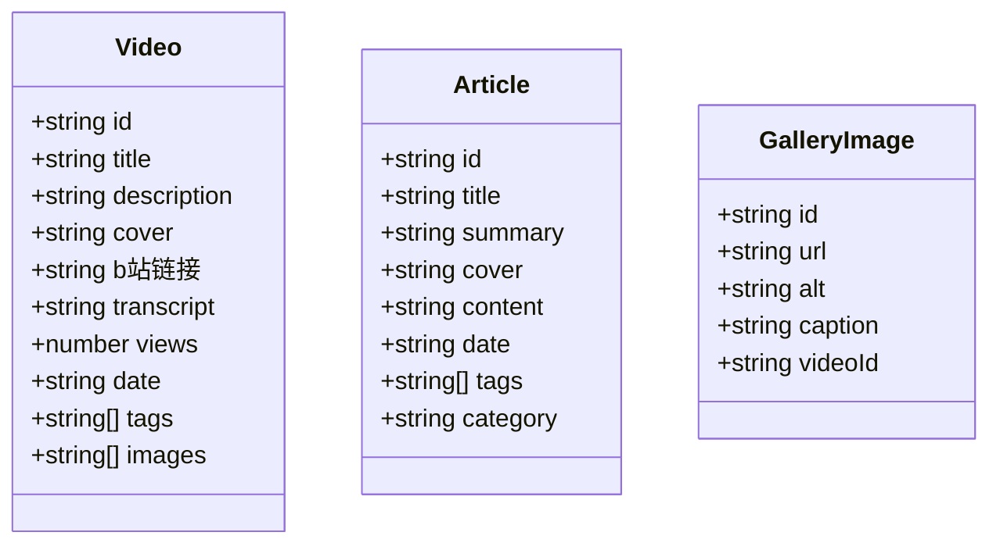

## 1. Architecture Design


## 2. Technology Description
- **Frontend**: React@18 + TypeScript + TailwindCSS@3
- **Build Tool**: Vite@6
- **Routing**: React Router DOM
- **Icons**: Lucide React
- **Hosting**: GitHub Pages
- **Deployment**: GitHub Actions

## 3. Route Definitions
| Route | Purpose | Component |
|-------|---------|-----------|
| `/` | 首页 | Home |
| `/videos` | 视频资料页 | Videos |
| `/videos/:id` | 视频详情页 | VideoDetail |
| `/articles` | 文章列表页 | Articles |
| `/articles/:id` | 文章详情页 | ArticleDetail |
| `/about` | 关于页 | About |

## 4. API Definitions
本项目为纯静态网站，无后端 API，所有数据通过 JSON 文件静态加载。

## 5. Project Structure
```
src/
├── components/          # 公共组件
│   ├── Header.tsx       # 导航头部
│   ├── Footer.tsx       # 页脚
│   ├── VideoCard.tsx    # 视频卡片
│   ├── ArticleCard.tsx  # 文章卡片
│   └── Gallery.tsx      # 图片画廊
├── pages/               # 页面组件
│   ├── Home.tsx         # 首页
│   ├── Videos.tsx       # 视频列表页
│   ├── VideoDetail.tsx  # 视频详情页
│   ├── Articles.tsx     # 文章列表页
│   ├── ArticleDetail.tsx# 文章详情页
│   └── About.tsx        # 关于页
├── data/                # 静态数据
│   ├── videos.ts        # 视频数据
│   ├── articles.ts      # 文章数据
│   └── gallery.ts       # 图片数据
├── types/               # TypeScript 类型定义
│   └── index.ts         # 全局类型
├── App.tsx              # 应用根组件
├── main.tsx             # 入口文件
└── index.css            # 全局样式
```

## 6. Data Model

### 6.1 Data Model Definition


### 6.2 Data Structure
**Video**:
```typescript
interface Video {
  id: string;
  title: string;
  description: string;
  cover: string;
  bilibiliUrl: string;
  transcript: string;
  views: number;
  date: string;
  tags: string[];
  images: string[];
}
```

**Article**:
```typescript
interface Article {
  id: string;
  title: string;
  summary: string;
  cover: string;
  content: string;
  date: string;
  tags: string[];
  category: string;
}
```

**GalleryImage**:
```typescript
interface GalleryImage {
  id: string;
  url: string;
  alt: string;
  caption: string;
  videoId?: string;
}
```

## 7. Deployment Strategy
1. 使用 `gh-pages` 包部署到 GitHub Pages
2. 配置 GitHub Actions 自动构建和部署
3. 项目设置中启用 GitHub Pages，选择 `gh-pages` 分支
