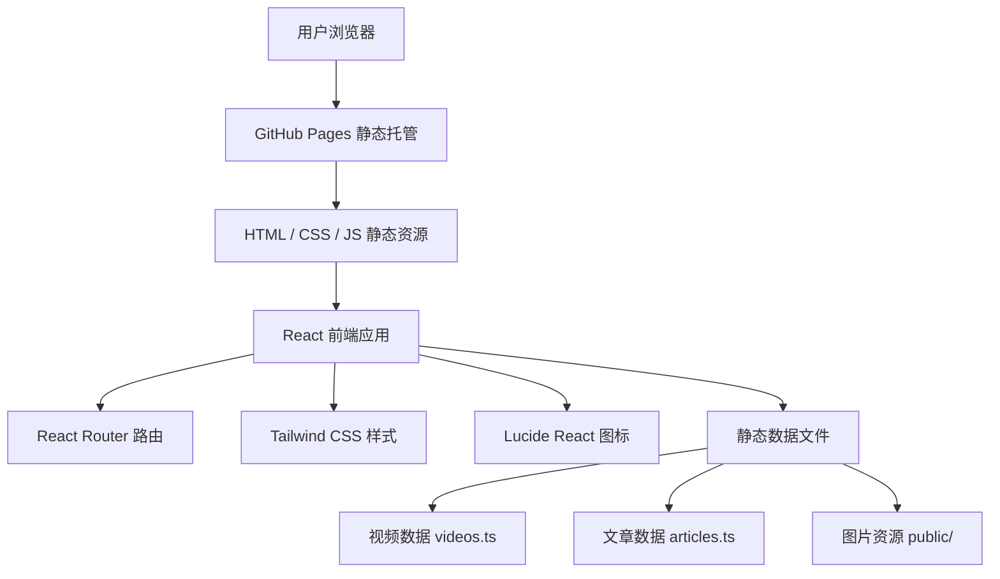

# 星渊博客 - 技术架构文档

## 1. 架构设计



---

## 2. 技术栈说明

### 2.1 核心技术

| 技术 | 版本 | 用途 |
|------|------|------|
| React | 18.3.1 | 前端框架 |
| TypeScript | 5.8.x | 类型系统 |
| Vite | 6.x | 构建工具 |
| Tailwind CSS | 3.4.x | 样式框架 |
| React Router DOM | 7.x | 路由管理 |
| Lucide React | 0.511.x | 图标库 |

### 2.2 开发工具

| 工具 | 用途 |
|------|------|
| ESLint | 代码质量检查 |
| TypeScript ESLint | TypeScript 代码检查 |
| PostCSS | CSS 处理 |
| Autoprefixer | CSS 自动前缀 |
| vite-tsconfig-paths | TypeScript 路径别名支持 |
| react-dev-locator | 开发环境组件定位 |

### 2.3 部署相关

| 工具 | 用途 |
|------|------|
| GitHub Actions | CI/CD 自动部署 |
| GitHub Pages | 静态网站托管 |
| gh-pages | 手动部署工具 |

---

## 3. 路由定义

| 路由路径 | 页面组件 | 页面标题 | 说明 |
|----------|----------|----------|------|
| `/` | Home | 星渊博客 | 首页 |
| `/videos` | Videos | 视频 - 星渊博客 | 视频列表 |
| `/videos/:id` | VideoDetail | {视频标题} - 星渊博客 | 视频详情 |
| `/articles` | Articles | 文章 - 星渊博客 | 文章列表 |
| `/articles/:id` | ArticleDetail | {文章标题} - 星渊博客 | 文章详情 |
| `/about` | About | 关于 - 星渊博客 | 关于页 |

### 3.1 路由配置

- **Basename**: 生产环境为 `/Asterial-Blog`，开发环境为 `/`
- **配置位置**: [App.tsx](file:///e:/Asterial%20Blog/src/App.tsx)
- **原因**: 适配 GitHub Pages 的子路径部署

```typescript
const basename = process.env.NODE_ENV === 'production' ? '/Asterial-Blog' : '/';
```

---

## 4. 项目结构

```
src/
├── components/              # 公共组件
│   ├── Header.tsx           # 导航头部组件
│   ├── Footer.tsx           # 页脚组件
│   ├── VideoCard.tsx        # 视频卡片组件
│   └── ArticleCard.tsx      # 文章卡片组件
├── pages/                   # 页面组件
│   ├── Home.tsx             # 首页
│   ├── Videos.tsx           # 视频列表页
│   ├── VideoDetail.tsx      # 视频详情页
│   ├── Articles.tsx         # 文章列表页
│   ├── ArticleDetail.tsx    # 文章详情页
│   └── About.tsx            # 关于页
├── data/                    # 静态数据
│   ├── videos.ts            # 视频数据
│   └── articles.ts          # 文章数据
├── config/                  # 配置文件
│   └── paths.ts             # 资源路径工具
├── types/                   # TypeScript 类型定义
│   └── index.ts             # 全局类型
├── App.tsx                  # 应用根组件
├── main.tsx                 # 入口文件
└── index.css                # 全局样式
```

---

## 5. 数据模型

### 5.1 类型定义

文件位置: [src/types/index.ts](file:///e:/Asterial%20Blog/src/types/index.ts)

#### Video（视频）

```typescript
interface Video {
  id: string;           // 唯一标识
  title: string;        // 视频标题
  description: string;  // 视频简介
  cover: string;        // 封面图片路径
  category: string;     // 分类
  transcript: string;   // 视频文字稿（Markdown格式）
  date: string;         // 发布日期
  tags: string[];       // 标签数组
  links: VideoLink[];   // 多平台观看链接
}
```

#### VideoLink（视频链接）

```typescript
interface VideoLink {
  platform: string;     // 平台名称（B站、抖音等）
  url: string;          // 链接地址
  icon: string;         // 图标标识
}
```

#### Article（文章）

```typescript
interface Article {
  id: string;           // 唯一标识
  title: string;        // 文章标题
  summary: string;      // 文章摘要
  cover: string;        // 封面图片路径
  content: string;      // 文章内容（Markdown格式）
  date: string;         // 发布日期
  tags: string[];       // 标签数组
  category: string;     // 分类
}
```

#### NavItem（导航项）

```typescript
interface NavItem {
  label: string;        // 显示文字
  href: string;         // 链接路径
}
```

### 5.2 数据管理

- 所有数据存储在 TypeScript 文件中，直接导出数组
- 无需后端 API，构建时静态打包
- 更新内容需修改代码文件并重新部署

---

## 6. 核心组件

### 6.1 Header 组件

**文件**: [src/components/Header.tsx](file:///e:/Asterial%20Blog/src/components/Header.tsx)

**功能**:
- 固定顶部导航栏
- 毛玻璃背景效果
- 响应式：桌面端完整导航，移动端汉堡菜单
- 当前页面高亮
- B站外链按钮

**状态**:
- `isScrolled`: 滚动状态（未使用，预留）
- `isMobileMenuOpen`: 移动端菜单开关

### 6.2 Footer 组件

**文件**: [src/components/Footer.tsx](file:///e:/Asterial%20Blog/src/components/Footer.tsx)

**功能**:
- 三栏网格布局（桌面端三栏，移动端单列）
  - 左栏：Logo + 网站简介
  - 中栏：导航链接（首页、视频、文章、关于）
  - 右栏：关注我（社交平台图标）
- 底部版权信息（自动获取年份）
- 顶部粉色装饰边框

### 6.3 BackToTop 组件

**文件**: [src/components/BackToTop.tsx](file:///e:/Asterial%20Blog/src/components/BackToTop.tsx)

**功能**:
- 滚动超过 300px 时显示
- 右下角固定定位，粉色圆形按钮
- 点击平滑滚动到顶部
- 淡入淡出动画效果

### 6.4 VideoCard 组件

**文件**: [src/components/VideoCard.tsx](file:///e:/Asterial%20Blog/src/components/VideoCard.tsx)

**功能**:
- 视频封面图（懒加载）
- 悬停效果：上浮、阴影加深、封面放大、播放按钮
- 视频标题（最多2行）
- 视频简介（最多2行）
- 发布日期
- 标签（最多2个）

### 6.4 图标组件

**目录**: [src/components/Icons/](file:///e:/Asterial%20Blog/src/components/Icons/)

| 组件 | 文件 | 用途 |
|------|------|------|
| BilibiliIcon | BilibiliIcon.tsx | B站品牌图标 |
| DouyinIcon | DouyinIcon.tsx | 抖音品牌图标 |
| XiguaIcon | XiguaIcon.tsx | 西瓜视频品牌图标 |

所有图标组件接收 `className` 属性控制尺寸，使用 `fill="currentColor"` 继承父元素颜色。

---

## 7. 页面实现

### 7.1 首页 Home

**文件**: [src/pages/Home.tsx](file:///e:/Asterial%20Blog/src/pages/Home.tsx)

**结构**:
- 最新视频区域（前3个）
- 最新文章区域（前3个）
- 空状态展示

### 7.2 视频列表 Videos

**文件**: [src/pages/Videos.tsx](file:///e:/Asterial%20Blog/src/pages/Videos.tsx)

**功能**:
- 面包屑导航
- 视频数量统计
- 响应式网格布局
- 返回顶部按钮

### 7.3 视频详情 VideoDetail

**文件**: [src/pages/VideoDetail.tsx](file:///e:/Asterial%20Blog/src/pages/VideoDetail.tsx)

**功能**:
- 返回按钮
- 视频封面
- 元信息：日期、分类、内容标注（个人观点，仅供参考）
- 简介卡片（粉色左边框）
- 标签区域（独立展示，粉色背景圆角标签）
- 多平台观看链接（B站、抖音、西瓜视频等，使用品牌色和品牌图标）
- 文字稿渲染（简易 Markdown 解析）
- 右侧目录导航（桌面端显示，根据 `##` 标题自动生成）

**目录导航实现**:
- 从文字稿中提取 `## ` 开头的标题行，生成锚点
- 使用 `IntersectionObserver` 监听滚动，高亮当前阅读章节
- 右侧 `sticky` 定位，`w-56` 宽度
- 当前章节：粉色文字 + 粉色背景 + 粉色左边框
- 移动端隐藏（`hidden lg:block`）

**平台图标映射**:
| 平台 | 图标组件 | 品牌色 |
|------|----------|--------|
| B站 | BilibiliIcon | #FB7299 |
| YouTube | lucide Youtube | #FF0000 |
| 抖音 | DouyinIcon | #000000 |
| 西瓜视频 | XiguaIcon | #FF6034 |

**Markdown 支持**:
- 二级标题 `## `（带 id 锚点，用于目录跳转）
- 三级标题 `### `
- 无序列表 `- `
- 代码块 ``` ``` ```
- 普通段落

### 7.4 文章列表 Articles

**文件**: [src/pages/Articles.tsx](file:///e:/Asterial%20Blog/src/pages/Articles.tsx)

同视频列表结构。

### 7.5 文章详情 ArticleDetail

**文件**: [src/pages/ArticleDetail.tsx](file:///e:/Asterial%20Blog/src/pages/ArticleDetail.tsx)

**功能**:
- 文章封面
- 元信息：日期、分类、阅读时间
- 分享和收藏按钮（UI展示，无功能）
- 标签列表
- 正文渲染（简易 Markdown 解析）
- 相关文章推荐

### 7.6 关于页 About

**文件**: [src/pages/About.tsx](file:///e:/Asterial%20Blog/src/pages/About.tsx)

**功能**:
- 头像展示
- 个人介绍
- B站链接

---

## 8. 样式系统

### 8.1 Tailwind 配置

**文件**: [tailwind.config.js](file:///e:/Asterial%20Blog/tailwind.config.js)

**自定义颜色**:
```javascript
bilibili: {
  pink: '#FB7299',
  blue: '#00A1D6',
  purple: '#8E82FE',
  orange: '#FF9F43',
}
```

**自定义动画**:
- `fade-in`: 淡入
- `slide-up`: 上滑淡入
- `scale-in`: 缩放淡入

### 8.2 全局样式

**文件**: [src/index.css](file:///e:/Asterial%20Blog/src/index.css)

**自定义工具类**:
- `.bilibili-pink-bg`: 粉色背景
- `.bilibili-blue-bg`: 蓝色背景
- `.bilibili-pink-text`: 粉色文字
- `.bilibili-blue-text`: 蓝色文字
- `.card-hover`: 卡片悬停效果

**自定义滚动条**:
- 宽度 8px
- 粉色滑块
- 悬停颜色加深

---

## 9. 静态资源处理

### 9.1 public 目录

**位置**: [public/](file:///e:/Asterial%20Blog/public/)

**资源**:
- `avatar.png` - 头像
- `cover.jpg` - 视频封面示例
- `favicon.svg` - 网站图标

**特点**:
- Vite 构建时直接复制到 dist 根目录
- 可通过根路径直接访问

### 9.2 路径工具函数

**文件**: [src/config/paths.ts](file:///e:/Asterial%20Blog/src/config/paths.ts)

**函数**:
```typescript
getAssetUrl(path: string): string
```

**用途**:
- 开发环境：返回 `/path`
- 生产环境：返回 `/Asterial-Blog/path`
- 适配 GitHub Pages 子路径部署

**使用示例**:
```typescript
import { getAssetUrl } from '../config/paths';

```

---

## 10. 部署策略

### 10.1 GitHub Pages 部署

**配置文件**: [.github/workflows/deploy.yml](file:///e:/Asterial%20Blog/.github/workflows/deploy.yml)

**触发条件**:
- 推送到 `main` 分支
- 手动触发（workflow_dispatch）

**部署步骤**:
1. 检出代码
2. 设置 Node.js 20
3. 安装依赖（npm ci）
4. 构建项目（npm run build）
5. 上传构建产物
6. 部署到 GitHub Pages

**权限配置**:
```yaml
permissions:
  contents: read
  pages: write
  id-token: write
```

### 10.2 Vite 配置

**文件**: [vite.config.ts](file:///e:/Asterial%20Blog/vite.config.ts)

**关键配置**:
```typescript
export default defineConfig({
  base: '/Asterial-Blog/',  // GitHub Pages 子路径
  build: {
    sourcemap: 'hidden',
    outDir: 'dist',
  },
  plugins: [
    react({ babel: { plugins: ['react-dev-locator'] } }),
    tsconfigPaths()
  ],
})
```

### 10.3 注意事项

1. **路由 basename**: React Router 需配置与 Vite base 一致的 basename
2. **静态资源路径**: 所有图片引用需通过 `getAssetUrl()` 处理
3. **HashRouter vs BrowserRouter**: 使用 BrowserRouter，GitHub Pages 通过 404.html 兜底（当前未配置，直接访问子路径会 404）

---

## 11. 构建命令

| 命令 | 说明 |
|------|------|
| `npm run dev` | 启动开发服务器 |
| `npm run build` | 类型检查 + 生产构建 |
| `npm run preview` | 预览构建结果 |
| `npm run lint` | 代码检查 |
| `npm run check` | 仅类型检查 |
| `npm run deploy` | 手动部署到 gh-pages 分支 |

---

## 12. 浏览器支持

- Chrome (最新版)
- Firefox (最新版)
- Safari (最新版)
- Edge (最新版)
- 移动端浏览器（Chrome on Android、Safari on iOS）
